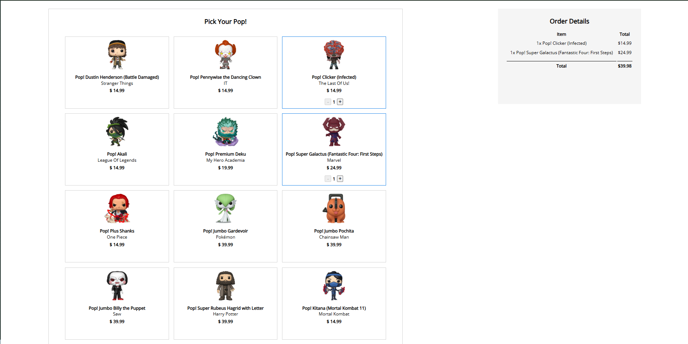

# Funko Shop 🎬🧸

Uma mini lojinha de **Funko Pop’s** feita para treinar **Vue.js** e compor meu portfólio.  
Projeto inicial, simples e direto: selecionar itens, ajustar quantidades e ver o total do pedido.

## Preview
<p>
  
</p>

## Funcionalidades
- Listagem de Funko Pop’s com imagem, nome, fandom e preço
- Seleção de itens (adicionar/remover)
- Controle de quantidade (+ / -)
- Resumo do pedido com total por item
- Total geral calculado automaticamente

## Tecnologias
- HTML5
- CSS3
- Vue.js (via CDN)

## Como rodar o projeto
### Opção 1: Abrir direto no navegador
1. Clone o repositório:
   ```bash
   git clone https://github.com/DevHyagooc/funkoshop.git
2. Abra o index.html no navegador.

### Opção 2: Rodar com Live Server
1. Instale a extensão Live Server no VS Code

2. Clique com o botão direito no index.html → Open with Live Server

## Estrutura do projeto
```txt
/
├─ index.html
├─ style.css
├─ scripts.js
├─ README.md
└─ img/
   ├─ preview/
   │  └─ preview.png
   └─ pops/
   │  └─ *-Funko.png
   └─ funkoIcon.svg
```

## Roadmap (Próximas melhorias)
- [ ] Implementar filtro e busca de produtos
- [ ] Persistir carrinho com LocalStorage
- [ ] Consumir API para produtos dinâmicos
- [ ] Migrar para Vite + Vue (estrutura moderna)
- [ ] Melhorar UI/UX com animações

## Autor
**Hyago Oliveira Costa**  
- GitHub: https://github.com/DevHyagooc  
- LinkedIn: https://www.linkedin.com/in/hyagooc/
